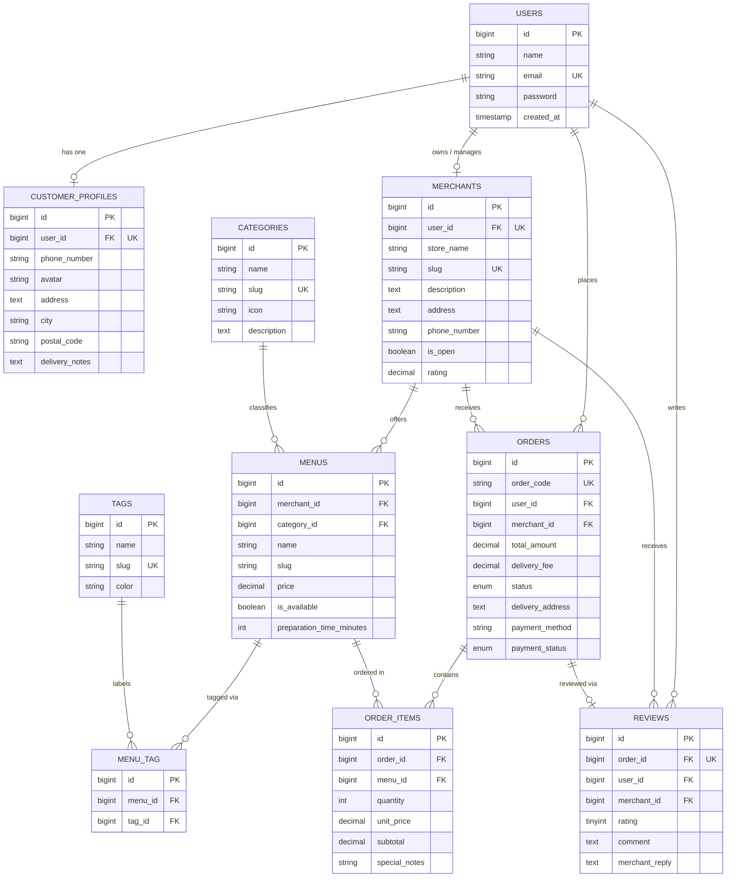

# LokalBites — Local MSME Food & Catering Ordering Platform

A comprehensive, scalable web application engineered with **Laravel**, **Eloquent ORM**, **Blade**, and **Tailwind CSS** designed to digitize order processing, menu management, and catering coordination for culinary Micro, Small, and Medium Enterprises (MSMEs / UMKM).

---

## 👨‍💻 Student & Project Metadata

| Field | Detail |
|---|---|
| **Author / Student** | **Muhammad Abdi Nur Salam** |
| **Student ID (NPM)** | **2410010482** |
| **Class** | **TI 5C REG BJB** |
| **Course** | Object-Oriented Programming 2 (Pemrograman Berorientasi Objek 2) |
| **Instructor** | Mirza Yogy Kurniawan, M.Kom |
| **Upstream Repository** | [mirzayogy/laravel5d](https://github.com/mirzayogy/laravel5d) |
| **Fork Repository** | [abdiins/laravel5d](https://github.com/abdiins/laravel5d) |
| **Active Branch** | `feature/database-relations` |
| **Pull Request** | [mirzayogy/laravel5d#6](https://github.com/mirzayogy/laravel5d/pull/6) |

---

## 📌 Executive Summary & Project Background

### The Problem
Traditional culinary MSMEs (*warung makan*, home caterers, and traditional pastry makers) often struggle with digitization:
1. **Inefficient Ordering Channels:** Manual orders via WhatsApp or phone calls frequently result in misplaced notes, missed dietary restrictions, and unclear delivery addresses.
2. **Lack of Menu Standardization:** Small vendors cannot easily present real-time item availability, preparation estimates, or customizable portion sizes.
3. **No Centralized Reputation Tracking:** Authentic local eateries lack verified review mechanisms to showcase quality and customer satisfaction compared to large multinational food chains.

### The Solution: LokalBites
**LokalBites** provides an accessible, structured digital platform tailored to local culinary merchants and catering businesses. It empowers local vendors to manage digital storefronts, showcase authentic menus with dietary/specialty tags, process incoming orders through a transparent state lifecycle, and collect verified customer reviews.

---

## 🚀 Core Modules & System Features

### 1. Customer Experience & Ordering Portal
- **Culinary Category Exploration:** Browse menus organized by intuitive categories (e.g., Heavy Meals & Rice, Traditional Pastries/Wadai, Beverages & Coffee, Snacks, Event Catering Packages).
- **Dietary & Specialty Filtering:** Discover items labeled with dynamic tags such as *Halal Certified*, *Local Heritage (Khas Banjar)*, *Spicy (Pedas Nampol)*, and *Best Seller*.
- **Detailed Custom Notes:** Customers can attach item-specific preparation notes (e.g., *"Separate broth"*, *"Less ice"*, *"No plastic cutlery"*).
- **Customer Profiles:** Store multiple delivery locations, phone numbers, postal codes, and default delivery instructions.

### 2. Merchant Storefront & Kitchen Operations
- **Store Profile Management:** Independent merchant profiles featuring business address, operational status (*Open/Closed* toggle), store banner, contact info, and aggregate star rating.
- **Menu Catalog Control:** Define prices, preparation times in minutes, availability status, descriptions, and linked tags.
- **Order Pipeline Monitoring:** Real-time visibility into incoming orders, customer details, and requested delivery schedules.
- **Review Response System:** Merchants can publicly reply to customer reviews to maintain brand transparency and goodwill.

### 3. Order Lifecycle State Machine
Orders progress through a strict, transparent state sequence:
```
[ Pending ] ──> [ Confirmed ] ──> [ Processing ] ──> [ Delivered ]
     │                                                     │
     └───> [ Cancelled ]                                   └───> [ Review Submitted ]
```

### 4. Verified Review Mechanism
- Each order can receive **exactly one** review after completion (enforced by a unique foreign key constraint `reviews.order_id`).
- Eliminates fake reviews by guaranteeing that only customers who placed and completed an order can rate the merchant.

---

## 🗄️ Database Architecture & Eloquent Relationships

The database architecture is designed according to strict relational normalization standards and leverages the full expressive power of Laravel's **Eloquent ORM**.

### 1. Relationship Mapping Matrix

| Relationship Type | Source Model | Target Model | Implementation & Eloquent Method | Description |
|---|---|---|---|---|
| **One-to-One** | `User` | `CustomerProfile` | `hasOne(CustomerProfile::class)` | Each customer has exactly one detailed shipping and contact profile. |
| **One-to-One** | `User` | `Merchant` | `hasOne(Merchant::class)` | A merchant owner user owns and operates one digital storefront. |
| **One-to-One** | `Order` | `Review` | `hasOne(Review::class)` | Each completed order is eligible for exactly one customer rating & feedback. |
| **One-to-Many** | `Category` | `Menu` | `hasMany(Menu::class)` | A category groups multiple related food and beverage items. |
| **One-to-Many** | `Merchant` | `Menu` | `hasMany(Menu::class)` | A merchant storefront offers multiple menu listings. |
| **One-to-Many** | `User` | `Order` | `hasMany(Order::class)` | A customer account can place multiple historical orders. |
| **One-to-Many** | `Merchant` | `Order` | `hasMany(Order::class)` | A merchant receives multiple customer orders over time. |
| **One-to-Many** | `Merchant` | `Review` | `hasMany(Review::class)` | A merchant collects feedback across all customer transactions. |
| **One-to-Many** | `User` | `Review` | `hasMany(Review::class)` | A customer can author reviews for their completed orders. |
| **One-to-Many** | `Order` | `OrderItem` | `hasMany(OrderItem::class)` | An order is composed of multiple discrete line items. |
| **Many-to-Many** | `Menu` | `Tag` | `belongsToMany(Tag::class, 'menu_tag')` | Menus carry multiple dietary tags (e.g. Halal, Spicy, Heritage). |
| **Many-to-Many (with Pivot Data)** | `Order` | `Menu` | `belongsToMany(Menu::class, 'order_items')->withPivot(['quantity', 'unit_price', 'subtotal', 'special_notes'])` | Orders connect to menus through a rich pivot table storing item quantities, transaction prices, and custom preparation notes. |
| **Has-Many-Through** | `Merchant` | `OrderItem` | `hasManyThrough(OrderItem::class, Menu::class)` | Allows a merchant to aggregate and analyze all sold items directly through their menu offerings. |
| **Has-Many-Through** | `User` | `OrderItem` | `hasManyThrough(OrderItem::class, Order::class)` | Allows a customer to retrieve all culinary items ever ordered through their historical orders. |

---

## 📊 Entity Relationship Diagram (ERD)



---

## 🛠️ Technology Stack

- **Backend Framework:** [Laravel 11/12](https://laravel.com)
- **Programming Language:** PHP 8.3 / 8.5
- **Database Engine:** SQLite (Local Dev) / MySQL 8.0+ (Production Ready)
- **ORM:** Eloquent ORM
- **Frontend Architecture:** Blade Templating Engine & Tailwind CSS
- **Bundler:** Vite
- **Version Control:** Git & GitHub

---

## 📁 Repository Structure

```text
laravel5d/
├── app/
│   └── Models/
│       ├── Category.php          # Category model with hasMany(Menu)
│       ├── CustomerProfile.php   # 1:1 Profile with belongsTo(User)
│       ├── Menu.php              # Belongs to Merchant & Category, M:N with Tag & Order
│       ├── Merchant.php          # Merchant storefront with hasManyThrough(OrderItem)
│       ├── Order.php             # Order lifecycle model with 1:1 Review & M:N Menu
│       ├── OrderItem.php         # Rich pivot model holding transaction details
│       ├── Review.php            # Verified rating & review model
│       ├── Tag.php               # Categorical badge model
│       └── User.php              # Core authentication & actor model
├── database/
│   ├── factories/                # Model factories for realistic test data generation
│   ├── migrations/               # 9 database migration files with strict constraints
│   └── seeders/                  # Authentic Banjar cuisine demonstration seeders
├── docs/
│   ├── database/
│   │   └── erd.md                # Comprehensive Mermaid ERD & relationship matrix
│   ├── guides/
│   │   └── fork-guide.md         # Step-by-step fork and contribution guide
│   └── progress/
│       └── P01-database-design.md # Assignment phase 1 milestone progress report
├── README.md                     # Project master documentation
└── composer.json                 # PHP package dependencies
```

---

## 🚀 Local Installation & Quickstart Guide

Follow these steps to run the application on your local machine:

### 1. Prerequisites
Ensure your local environment satisfies:
- PHP >= 8.2 (with `pdo`, `sqlite3`, `mbstring`, `openssl`, and `zip` extensions enabled)
- [Composer](https://getcomposer.org/) >= 2.5
- [Node.js](https://nodejs.org/) >= 18.x and NPM

### 2. Clone the Repository
```bash
git clone https://github.com/abdiins/laravel5d.git
cd laravel5d
```

### 3. Install Dependencies
```bash
# Install PHP vendor packages
composer install

# Install frontend packages
npm install
```

### 4. Configure Environment
```bash
# Create local environment configuration
cp .env.example .env

# Generate encryption application key
php artisan key:generate
```

### 5. Initialize Database & Seed Authentic Demo Data
```bash
php artisan migrate:fresh --seed
```

The seeder populates authentic local heritage cuisine (*Soto Banjar kuah kaldu bebek*, *Nasi Kuning Haruan*, *Wadai Bingka Kentang Bakar*, and *Es Limau Kuit*) along with completed orders and reviews.

### 6. Run Development Servers
Open two terminal windows:

**Terminal 1 (Vite Asset Server):**
```bash
npm run dev
```

**Terminal 2 (Laravel Web Server):**
```bash
php artisan serve
```

Open your browser and navigate to **`http://localhost:8000`**.

---

## 🧪 Verification & Relationship Testing

You can verify all Eloquent relationships directly using Laravel Tinker:

```bash
php artisan tinker
```

```php
// 1. Verify One-to-One
$customer = App\Models\User::where('email', 'customer@lokalbites.test')->first();
$customer->profile->address; // Returns customer street address

// 2. Verify One-to-Many
$merchant = App\Models\Merchant::first();
$merchant->menus->pluck('name'); // Lists all store menus

// 3. Verify Many-to-Many with Pivot Data
$order = App\Models\Order::first();
foreach ($order->menus as $item) {
    echo $item->name . ' - Qty: ' . $item->pivot->quantity . ' - Subtotal: Rp' . number_format($item->pivot->subtotal);
}

// 4. Verify Has-Many-Through
$merchant->orderItems->count(); // Returns total individual items ordered across all store menus
```

Automated test suites can be executed via:
```bash
php artisan test
```

---

## 🗺️ Project Roadmap (Future Milestones)

- **Phase 1 (Completed):** Relational Database Design, Eloquent Models, Migrations, Factories, Seeders, and ERD.
- **Phase 2 (Planned):** Authentication, Multi-Auth Roles (Customer, Merchant, Admin), and Profile Dashboards.
- **Phase 3 (Planned):** Interactive Menu Catalog, Shopping Cart (Session/Database), and Checkout Workflow.
- **Phase 4 (Planned):** Merchant Order Processing Dashboard, Invoice PDF Generation, and Payment Gateway Integration.

---

## 📄 License
This project is developed for educational purposes under the **MIT License**.
