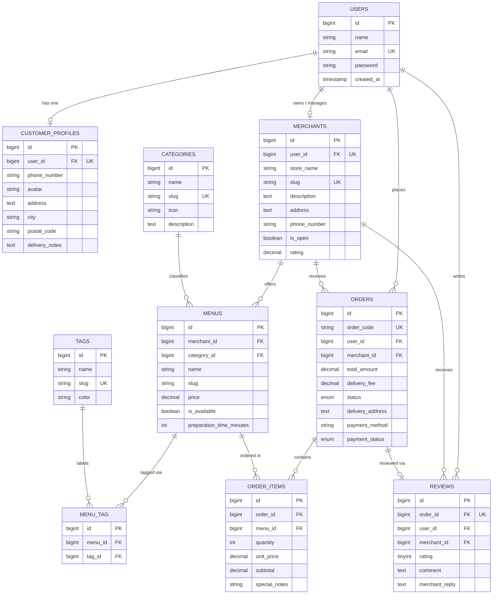

# Database Design — Entity Relationship Diagram (LokalBites)

This document provides the complete database architectural specification, schema definitions, and Eloquent Object-Relational Mapping (ORM) relationships for the **LokalBites** local MSME food and catering platform.

---

## 1. Entity Relationship Diagram (ERD)

---

## 2. Eloquent Relationship Mapping

| Relationship Type | Source Model | Target Model | Description & Eloquent Method |
|---|---|---|---|
| **One-to-One** | `User` | `CustomerProfile` | One user has one profile: `$this->hasOne(CustomerProfile::class)` |
| **One-to-One** | `User` | `Merchant` | One merchant owner manages one store: `$this->hasOne(Merchant::class)` |
| **One-to-One** | `Order` | `Review` | Each completed order is eligible for exactly one review: `$this->hasOne(Review::class)` |
| **One-to-Many** | `Category` | `Menu` | A category groups multiple menus: `$this->hasMany(Menu::class)` |
| **One-to-Many** | `Merchant` | `Menu` | A merchant offers multiple food/beverage menus: `$this->hasMany(Menu::class)` |
| **One-to-Many** | `User` | `Order` | A customer can place multiple historical orders: `$this->hasMany(Order::class)` |
| **One-to-Many** | `Merchant` | `Order` | A merchant receives multiple customer orders: `$this->hasMany(Order::class)` |
| **One-to-Many** | `Merchant` | `Review` | A merchant receives reviews from multiple customers: `$this->hasMany(Review::class)` |
| **Many-to-Many** | `Menu` | `Tag` | Menus carry multiple labels (Halal, Spicy, Best Seller) via `menu_tag` |
| **Many-to-Many (Pivot Data)** | `Order` | `Menu` | Orders connect to menus via `order_items` with pivot fields: `quantity`, `unit_price`, `subtotal`, `special_notes` |
| **Has-Many-Through** | `Merchant` | `OrderItem` | A merchant can query all items sold through its menu catalog: `$this->hasManyThrough(OrderItem::class, Menu::class)` |
| **Has-Many-Through** | `User` | `OrderItem` | A customer can query all items purchased across all historical orders: `$this->hasManyThrough(OrderItem::class, Order::class)` |

---

## 3. Data Integrity Constraints & Business Rules

1. **Foreign Key Cascade Policies:**
   - Deleting a `User` cascades to remove their `CustomerProfile` and associated user records.
   - Deleting an `Order` cascades to remove the corresponding `OrderItems` and `Review`.
2. **Foreign Key Restrict Policies:**
   - A `Category` cannot be deleted if there are active `Menu` records attached to it.
   - A `Menu` cannot be deleted if it has historical transaction records in `OrderItem`.
3. **Unique Keys:**
   - `orders.order_code` is globally unique.
   - `reviews.order_id` is unique, preventing duplicate reviews for the same order transaction.
   - The composite pair `[menu_id, tag_id]` on `menu_tag` is unique to prevent duplicate tag attachments.
