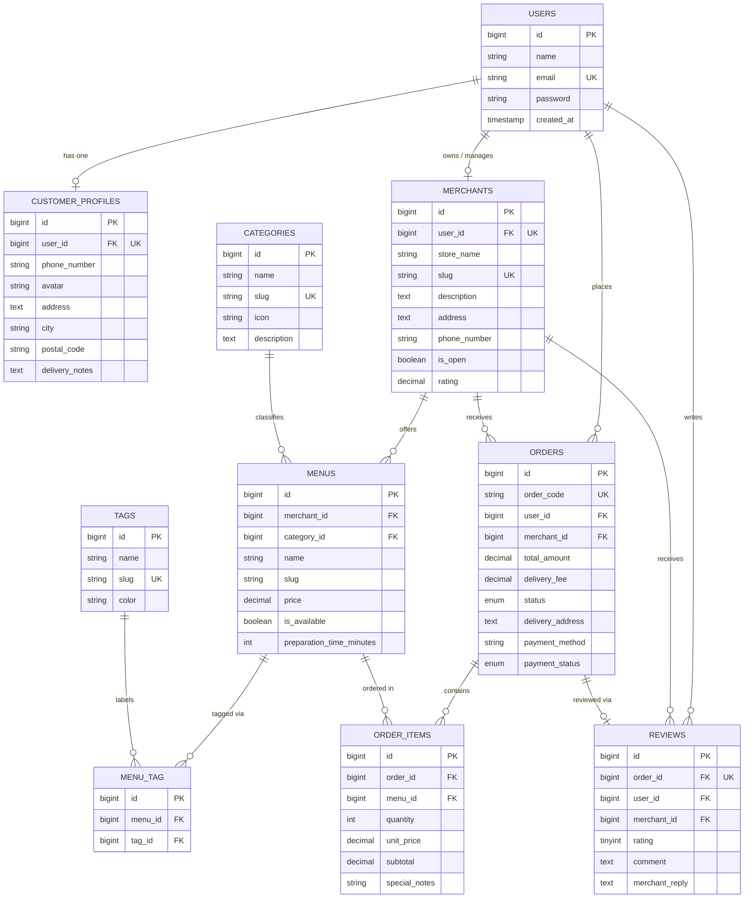

# Database Design — Entity Relationship Diagram (LokalBites)

Dokumen ini menjelaskan skema basis data dan perancangan relasi Eloquent ORM untuk platform **LokalBites** (Platform Pemesanan Makanan & Katering UMKM Lokal).

---

## 1. Entity Relationship Diagram (ERD)

---

## 2. Pemetaan Relasi Eloquent

| Tipe Relasi | Model Asal | Model Tujuan | Keterangan & Metode Eloquent |
|---|---|---|---|
| **One-to-One** | `User` | `CustomerProfile` | Satu user memiliki satu profil pelanggan: `$this->hasOne(CustomerProfile::class)` |
| **One-to-One** | `User` | `Merchant` | Satu user pemilik toko mengelola satu merchant: `$this->hasOne(Merchant::class)` |
| **One-to-One** | `Order` | `Review` | Setiap pesanan yang selesai hanya dapat diulas satu kali: `$this->hasOne(Review::class)` |
| **One-to-Many** | `Category` | `Menu` | Kategori mengelompokkan banyak menu: `$this->hasMany(Menu::class)` |
| **One-to-Many** | `Merchant` | `Menu` | Merchant memiliki banyak pilihan menu: `$this->hasMany(Menu::class)` |
| **One-to-Many** | `User` | `Order` | Customer dapat membuat banyak pesanan: `$this->hasMany(Order::class)` |
| **One-to-Many** | `Merchant` | `Order` | Merchant menerima banyak pesanan: `$this->hasMany(Order::class)` |
| **Many-to-Many** | `Menu` | `Tag` | Menu dapat memiliki banyak label (Halal, Pedas, Best Seller) via `menu_tag` |
| **Many-to-Many (Pivot Data)** | `Order` | `Menu` | Pesanan mencakup banyak menu via `order_items` dengan atribut pivot: `quantity`, `unit_price`, `subtotal`, `special_notes` |
| **Has-Many-Through** | `Merchant` | `OrderItem` | Merchant dapat melacak semua item yang terjual melalui menu miliknya: `$this->hasManyThrough(OrderItem::class, Menu::class)` |
| **Has-Many-Through** | `User` | `OrderItem` | Customer dapat mengakses semua riwayat item makanan yang pernah dibeli melalui order: `$this->hasManyThrough(OrderItem::class, Order::class)` |

---

## 3. Aturan Integritas Data (Constraints)

1. **Foreign Key Cascade:**
   - Menghapus `User` akan menghapus `CustomerProfile` dan data pesanan terkait.
   - Menghapus `Order` akan menghapus rincian `OrderItems` dan `Review`.
2. **Foreign Key Restrict:**
   - `Category` tidak dapat dihapus jika masih terdapat `Menu` aktif di dalamnya.
   - `Menu` tidak dapat dihapus jika pernah tercatat dalam transaksi `OrderItem`.
3. **Unique Keys:**
   - `orders.order_code` bersifat unik.
   - `reviews.order_id` bersifat unik (1 order = 1 review).
   - Pasangan `[menu_id, tag_id]` pada tabel pivot `menu_tag` bersifat unik.
